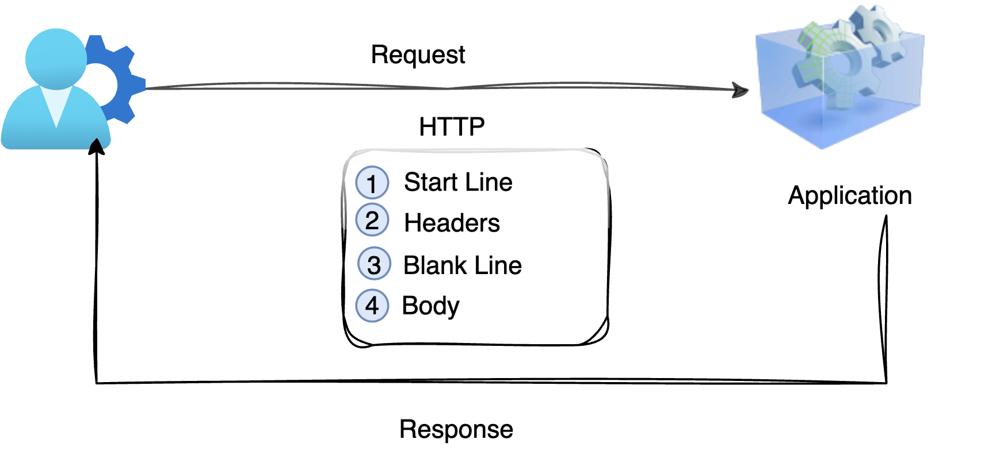

Before we deep dive into API protocols, let’s first understand what a **Web Service** is and how it is different from an **API** 🤔

---

## What is a Web Service?

Let’s break down the term:

- **Web** 🌐 → Refers to the internet
- **Service** ⚙️ → A functionality or operation provided by an application (which we can relate to an API)

So, we can say:

👉 A **Web Service is an API that communicates over the internet.**

---

### Now the Big Question…

What is the difference between a Web Service and an API?

Yes, there **is** a difference 😄

👉 **All Web Services are APIs**  
👉 **But not all APIs are Web Services**

Huh!!! Sounds confusing? 😵  
Don’t worry… let’s understand this with a simple example.

---

### Example

Suppose you open a weather application to check temperature data 🌤️

When the application needs weather information, it may call another internal API inside the same application network. These APIs work within the application or system boundary and do not necessarily use the internet.

These types of APIs are often considered **internal or closed APIs** 🔒  
Since they do not use web communication, they are **not Web Services**.

---

### When Does an API Become a Web Service?

If an API communicates over the internet using web protocols like HTTP or HTTPS 🌐, it becomes a Web Service.

---

### In a Nutshell

- API → Any interface that allows applications to communicate
- Web Service → An API that specifically uses the internet for communication

## What Are API Protocols?

Now that we understand what APIs and Web Services are, let’s move one step ahead and talk about **API Protocols** 🚀

An API protocol defines **how communication happens** between two applications.  
It sets the rules for sending requests, receiving responses, and exchanging data.

Think of API protocols as the **language and rules** that applications follow while talking to each other

---

## Why Do We Need API Protocols?

When two applications communicate, they need to agree on:

- How the request should be sent
- How the data should be formatted
- How the response should be returned
- How errors should be handled

API protocols make sure this communication happens in a **standard and reliable way**.

Without protocols, every application would talk in its own language — total chaos 😵

---

## Commonly Used API Protocols

In modern application development and integrations, some API protocols are used more frequently than others.

The most commonly used API protocols are:

- **HTTP / HTTPS**
- **SOAP**
- **OData**

Each of these protocols follows different communication rules and is designed to solve different integration needs.

### HTTP / HTTPS

HTTP (Hypertext Transfer Protocol) and HTTPS (Secure HTTP) are the most widely used communication protocols for APIs.

There are four main parts in an HTTP message:

---

#### HTTP Start Line

Both Request and Response messages contain an HTTP version.

In the **Request Start Line**, it includes the HTTP method (such as GET, POST, DELETE, etc.).  
However, in the **Response Start Line**, there is no method.

The Request Start Line also contains the API program location (resource path) and parameters.  
The Request Start Line does not contain a status code, whereas the Response Start Line contains a status code (for example: 200 OK).

##### Format Structure

- Request Format → Method + Space + API Program Folder Location + Parameters + Space + HTTP Version
- Response Format → HTTP Version + Space + Status Code

| Element                      | Request Start Line | Response Start Line |
| ---------------------------- | ------------------ | ------------------- |
| HTTP Version                 | Present            | Present             |
| Method                       | Present            | Not Present         |
| API Location / Resource Path | Present            | Not Present         |
| Parameters                   | Present            | Not Present         |
| Status Code                  | Not Present        | Present             |

##### Example

Request → `GET /search?q=SAP CPI HTTP/1.1`  
Response → `HTTP/1.1 200 OK`

---

#### HTTP Headers

HTTP headers contain additional information about the request or response.

They help the client and server understand how the message should be processed, what type of data is being sent, and how the communication should be handled.

In a request, headers may include details such as authorization information, content type, and accepted response formats.

In a response, headers provide information about the server, response format, caching rules, and other metadata.

Headers act like instructions that guide how the communication happens between systems.

---

#### HTTP Blank Line

After the headers, there is always a blank line.

This blank line is important because it separates the headers from the body of the message.

It tells the system that the header section has ended and the actual data content starts next.

Without this separation, the message structure would not be correctly understood.

---

#### HTTP Body

The HTTP body contains the actual data being sent between the client and server.

In a request, the body usually carries data when we send information to the server, such as form data, JSON payload, or XML data.

In a response, the body contains the result returned by the server, such as data records, files, or messages.
ß
Not all requests contain a body. For example, GET requests often do not have a body, while POST or PUT requests usually include one.

The body is the main content part of the HTTP message where the actual information exchange happens.

### SOAP

SOAP is a strict messaging protocol that uses XML for data exchange.  
It follows predefined standards for message formatting, security, and reliability.

SOAP is commonly used in enterprise-level integrations.

---

### OData

OData is a standardized protocol built on top of HTTP.  
It provides advanced methods for querying, filtering, and managing structured data.

OData is widely used in enterprise systems, especially in SAP environments.

---

## API Architectural Styles

API architectural styles define **how APIs are designed and structured**.  
They describe how resources are accessed and how operations are performed.

### REST

REST is a lightweight and widely used API design style.

It uses HTTP/HTTPS protocols for communication and focuses on resource-based interactions.

REST APIs are popular due to their simplicity, scalability, and flexibility.

---

## Relationship Between API Protocols and API Styles

It is important to understand how protocols and architectural styles work together.

- REST APIs usually use HTTP or HTTPS protocols.
- SOAP APIs include their own messaging protocol and XML structure.
- OData APIs are built using HTTP and REST principles, with additional data standards.

---

## Comparison Overview

## Comparison Overview

| Standard     | Category            | Purpose                                     |
| ------------ | ------------------- | ------------------------------------------- |
| HTTP / HTTPS | Protocol            | Transfers data between systems              |
| SOAP         | Protocol            | Structured enterprise communication         |
| OData        | Protocol / Standard | Advanced data access and querying           |
| REST         | Architectural Style | Defines API design and interaction approach |

---

One important thing to remember is:

- **API protocols** define _how data is transferred_
- **API design styles** define _how APIs are structured_

For example:

- REST APIs usually use **HTTP or HTTPS** protocols
- SOAP APIs come with their **own strict protocol and message structure**
- OData APIs are built on **HTTP and REST principles**, with additional standards

---

### 👉 Final Thoughts

API protocols define the communication rules between applications.  
They ensure that requests and responses are exchanged in a consistent, secure, and understandable way.
